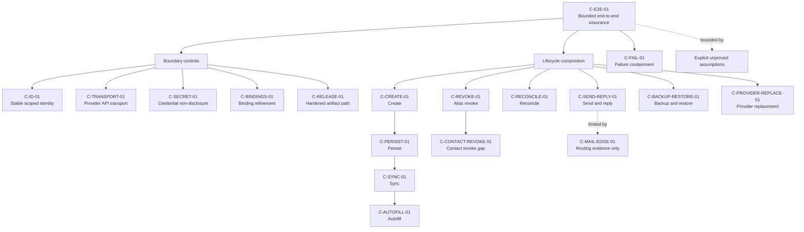

# Public alias end-to-end security assurance case

Status: bounded assurance argument for the canonical public alias SDK. This is not a claim that the
whole socio-technical system is mathematically proved.

## Evaluated snapshot

The case was built from `origin/integration/alias-platform` at exactly
`ff60528b2f899baec1cea72fd8efbdc509fbab4e` on 2026-08-13. The worktree was created at that commit
and the generated branch was renamed to `docs/end-to-end-security-assurance` before the audit.

The following pushed branch tips were inspected read-only. Every recorded commit is an ancestor of
the evaluated base; historical branch heads are provenance, not separate release inputs.

| Pushed branch | Exact inspected tip | Focus |
| --- | --- | --- |
| `origin/feat/alias-core` | `00a534cad1698dd7e2e52536a2f8630676511ae3` | Rust lifecycle and transport invariants |
| `origin/feat/alias-reconciliation` | `778f27664c5ee218ca1e6dfed422517272713576` | Vault binding and reconciliation |
| `origin/feat/alias-bindings` | `adfbac3886e3f03197ff58afbec78ad799908b45` | WASM and UniFFI surfaces |
| `origin/test/alias-security` | `45d88e9a83c0357f8b7aa2d3c2a8004544b5ea3c` | Adversarial provider tests |
| `origin/test/simplelogin-integration-lab` | `2466f628fbebe2f2449a2ebb9ac9febefc8d2479` | Owned-provider and mail-edge behavior |
| `origin/audit/alias-first-class-security` | `cf95cf4b1238519f8cfd6e22e1f8ea948f205642` | Lifecycle and artifact-boundary hardening |
| `origin/integration/alias-secure-connection` | `8e7a52bcb4ca52eba28f0cc7ec574d784abc0fc7` | Stable provider-account identity |
| `origin/security/alias-formal-model` | `51d294fa38fac3dc984553660f3719f74972b40d` | TLA+ model and conformance vectors |
| `origin/build/alias-sdk-release-lane` | `b4564cb4b8b4c9882fb188de64e962e3faf6c438` | Clean consumers and release controls |
| `origin/integration/alias-platform` | `ff60528b2f899baec1cea72fd8efbdc509fbab4e` | Evaluated integration result |

## Scope and assurance vocabulary

In scope are create, persist, sync, autofill, send/reply, reconcile, revoke, backup/restore, and
provider replacement for the current reference schema and hardened alias-enabled SDK artifacts.
Personal migration, domain management, provider branding, and secret material are excluded. The
legacy generator implementation compiled without the `alias` feature is also outside this case;
the release boundary separately verifies that canonical alias artifacts enable the hardened path.

`supported` means the claim is supported within its stated SDK boundary. `assumption-bound` means
the available proof or test stops at a named external boundary. `gap` means the current interface
does not justify the stronger security property. TLA+ results are exhaustive only for their finite
configured abstractions, and conformance tests cover represented traces rather than proving total
model-to-code refinement.

## Assets and principals

| ID | Asset | Required property |
| --- | --- | --- |
| `AS-01` | Provider API credential and short-lived creation authorization | Confidentiality and least exposure |
| `AS-02` | Stable provider-account and alias identity | Integrity, non-confusion, and continuity |
| `AS-03` | Alias address, forwarding mailbox, contact, and reverse-alias metadata | Confidentiality in trusted storage and bounded disclosure |
| `AS-04` | Provider lifecycle state | Authorized, intention-preserving mutation |
| `AS-05` | Vault login, hidden alias reference, and unrelated cipher data | Confidentiality, integrity, atomic preservation, and recoverability |
| `AS-06` | User intent to create, reconcile, disable, delete, restore, or replace | No silent destructive widening or blind replay |
| `AS-07` | Mail content and routing metadata | Delivery correctness subject to the mail-edge limitation below |
| `AS-08` | SDK source and generated artifacts | Provenance and binding consistency |

| ID | Principal | Role and authority |
| --- | --- | --- |
| `P-USER` | Authenticated user | Authorizes provider and vault actions |
| `P-CLIENT` | Product client | Owns connection identity, decrypted memory, UI, autofill, persistence, sync, backup, and restore |
| `P-SDK` | Rust core and generated bindings | Validates inputs, provider responses, references, and local transitions |
| `P-VAULT` | Vault crypto, storage, and sync services | Encrypts, persists, merges, and distributes cipher state |
| `P-PROVIDER` | Owned alias provider API and storage | Authorizes the account and maintains aliases, contacts, and forwarding state |
| `P-MAIL` | Provider mail edge and downstream mail systems | Routes forward and reverse-alias messages |
| `P-CONTACT` | External site, sender, or correspondent | Supplies untrusted mail and contact input |
| `P-PLATFORM` | OS, browser, runtime, PKI, DNS, and release environment | Hosts cryptography, TLS, FFI, network resolution, and artifact execution |

## Trust, cryptographic, and transport boundaries

1. **Client and FFI boundary.** Provider data and decrypted `CipherView` values cross WASM or
   UniFFI in plaintext process memory. Sensitive wrappers reduce accidental rendering; they do not
   create a cryptographic boundary. A compromised client process is outside the claim.
2. **Vault cryptographic boundary.** The alias crate returns a decrypted login whose username and
   one hidden field may have changed. The caller's normal authenticated vault encryption,
   persistence, sync, and key management are the confidentiality and integrity boundary. The alias
   crate implements no independent at-rest encryption and makes no key-management claim.
3. **Provider API transport boundary.** The native client uses the SDK TLS stack, disables
   redirects and protocol retries, and sends the credential only in the sensitive
   `Authentication` header. WASM uses one manual-redirect, credential-omitting fetch. Non-loopback
   provider clients require HTTPS; loopback HTTP exists only for local operation. PKI, DNS,
   runtime, and server authentication remain assumptions.
4. **Provider storage boundary.** The provider necessarily sees alias, mailbox, contact, reverse
   alias, and routing state. Its authorization and truthful fresh reads are trusted. Invalid,
   oversized, conflicting, delayed, replayed, and lost responses are handled defensively, but a
   provider that lies consistently is outside the model.
5. **Mail edge.** SMTP delivery and the owned provider's mail handler are an operational boundary,
   not end-to-end cryptography. `support_pgp` and `disable_pgp` are provider state, not a proof that
   any tested message was end-to-end encrypted or authenticated.
6. **Artifact boundary.** Canonical alias-enabled packages are expected to come from the gated
   release lane. A consumer that substitutes bindings, disables the hardened feature path, or
   ignores artifact provenance leaves this case.

## Attacker capabilities

The argument includes an attacker who can supply hostile provider JSON and status codes; oversized
or chunked bodies; redirects; malformed identifiers and references; duplicate or foreign vault
claims; stale plans; concurrent mutations; delayed or replayed toggle bodies; and transport loss
after a mutation is dispatched. It also includes a malicious or mistaken external sender and a
device presenting a restored or synced cipher with hostile alias metadata.

The argument does not defeat compromise of the client process, vault keys, provider operator,
release signing authority, TLS trust roots, DNS control, or mailbox account. It does not assume
availability under permanent provider failure or continuous interference. It does not prove email
sender authenticity, spam resistance, metadata privacy, or content confidentiality across the mail
edge.

## Explicit trust assumptions

Every item below is marked `not-mathematically-proven` in the traceability manifest.

| ID | Assumption |
| --- | --- |
| `A-CLIENT-IDENTITY` | The client creates one random canonical UUID v4 per provider account, persists it, never derives it from credentials, and never reuses it for a replacement account. |
| `A-CLIENT-INTEGRATION` | The client uses the SDK reference APIs, does not infer bindings from addresses, and treats unknown mutation outcomes as reconciliation prompts rather than retry signals. |
| `A-VAULT-CRYPTO` | Vault encryption, key handling, authentication, and decrypted-memory controls correctly protect the full cipher, including the hidden reference. |
| `A-SYNC-PERSISTENCE` | The client atomically encrypts and persists returned ciphers, applies an appropriate sync conflict policy, and supplies a complete provider inventory when relying on missing or unbound results. |
| `A-AUTOFILL` | The client uses its normal origin and user-intent checks before autofilling `login.username` and never treats the hidden reference as display or autofill content. |
| `A-PROVIDER` | The authenticated provider account owns the selected stable IDs, enforces authorization, keeps IDs stable and non-zero, and returns truthful fresh reads. |
| `A-TRANSPORT` | TLS implementation, PKI, DNS, host runtime, and the configured provider origin are trustworthy outside the tested redirect and URL-shape controls. |
| `A-MAIL-EDGE` | The owned provider, mailbox, DNS, and downstream mail systems apply the intended routing and retention policies; message confidentiality and authenticity require controls outside this SDK. |
| `A-BACKUP` | Product export, backup, import, and restore preserve the hidden field and protect backup material with controls appropriate to its plaintext or encrypted form. |
| `A-ARTIFACT` | Consumers verify the source commit and artifact digest and do not mix independently generated bindings or unhardened feature configurations. |

## Claim-evidence-argument graph



The top claim composes only if each stage remains within the same stable provider identity and the
named caller boundaries hold. Formal evidence establishes selected safety and liveness properties
for finite abstractions. Shared vectors then test represented refinements in Rust and bindings.
Owned-provider tests supply operational evidence for API, storage, forwarding, and reply behavior.
No edge silently upgrades operational observations into a cryptographic or universal claim.

## Claims and failure containment

| Claim | Status | Argument and containment guarantee |
| --- | --- | --- |
| `C-E2E-01` | assumption-bound | The supported stage claims compose into a bounded assurance case when all named assumptions hold. Failure at an external boundary stops the stronger end-to-end conclusion rather than being treated as proof. |
| `C-ID-01` | supported | Mutations and references use provider, canonical instance, connection UUID, and provider alias ID. Address snapshots do not authorize mutation; foreign identities are rejected or skipped. |
| `C-TRANSPORT-01` | supported | Credentials are header-only, redirects and automatic retries are disabled, response sizes and types are bounded, provider error text is discarded, and retained native errors omit URLs. A transport failure after dispatch becomes an explicit unknown outcome. |
| `C-SECRET-01` | supported | Current references contain exactly six non-credential fields. Unknown fields fail closed and sensitive values are not rendered by reference, provider, or reconciliation errors. This is source-flow and test evidence, not a full noninterference proof of the process. |
| `C-BINDINGS-01` | supported | WASM and UniFFI delegate reference, reconciliation, and lifecycle behavior to the Rust core and consume shared vectors. Host code still controls plaintext values and persistence after return. |
| `C-RELEASE-01` | assumption-bound | The release lane checks that alias artifacts use the hardened generator path, match source provenance, exclude disallowed surfaces, and build clean consumers. Consumer verification remains external. |
| `C-CREATE-01` | supported | A valid create is dispatched once and its returned alias shape and stable ID are validated. Transport ambiguity or invalid success data never authorizes a blind replay; the caller must list or reconcile. Creation plus vault persistence is not atomic. |
| `C-PERSIST-01` | assumption-bound | Binding validates current canonical metadata and changes only `login.username` and the single hidden reference field in a decrypted login. The SDK returns the value; vault encryption and durable commit belong to the client. |
| `C-SYNC-01` | assumption-bound | A synchronized current reference can be parsed and reconciled without address inference, and foreign or malformed references fail closed. The alias crate has no sync transaction, merge, or rollback implementation. |
| `C-AUTOFILL-01` | assumption-bound | The SDK places the validated provider address in `login.username` and keeps identity metadata in a hidden field. Site matching, UI disclosure, and autofill authorization are client responsibilities and are not tested here. |
| `C-SEND-REPLY-01` | assumption-bound | Contact and reverse-alias API responses are shape-validated, and the pinned owned-provider lab observes one forward and one reply with persisted activity. This establishes routing behavior only. |
| `C-MAIL-EDGE-01` | assumption-bound | The provider operator and mail infrastructure sit inside the trusted operational boundary. The case makes no end-to-end message confidentiality, authenticity, anti-abuse, or availability claim. |
| `C-RECONCILE-01` | supported | Planning is deterministic and non-mutating. Apply rejects duplicates, foreign claims, stale plans, and invalid actions before the first edit; it is idempotent and preserves unrelated cipher state. Missing and unbound conclusions require a complete provider inventory. |
| `C-REVOKE-01` | supported | Alias disable uses read, bounded toggle, and verified read; delete is distinct, dispatched at most once, and never edits the vault cipher. Unknown outcomes require reconciliation, while the retained vault reference can safely remain stale. |
| `C-CONTACT-REVOKE-01` | gap | Contact blocking exposes the provider's toggle and trusts its response without a fresh read or desired-state convergence loop. It must not be presented as idempotent revocation equivalent to alias disable. Contact deletion retains the no-automatic-replay transport behavior but has no read-back proof. |
| `C-BACKUP-RESTORE-01` | assumption-bound | A real `CipherView` JSON round trip preserves and re-parses the hidden reference. This is a serialization check, not evidence that every product backup format includes the field or protects exported data. Restore must parse before using or reconciling metadata. |
| `C-PROVIDER-REPLACE-01` | assumption-bound | A replacement account receives a new connection UUID. Existing references then classify as foreign and cannot authorize repair or mutation under the new connection. Address continuity and explicit user-authorized rebinding are operational tasks; no automatic replacement or migration is claimed. |
| `C-FAIL-01` | supported | Invalid input fails before dispatch; hostile responses fail before use; reconciliation prevalidates all edits; identity mismatch prevents mutation; bounded interference terminates; unknown non-idempotent outcomes are not replayed; and provider disable/delete never cascade into vault deletion. |

## End-to-end operation argument

| Operation | What is established | What remains outside the claim |
| --- | --- | --- |
| Create | One dispatch, bounded input/output, stable returned ID, explicit ambiguity | Atomic create-and-save, provider uniqueness beyond its authorization |
| Persist | Canonical current reference, hidden field, narrow two-field mutation | Vault encryption, upload, crash consistency |
| Sync | Strict parse, account scoping, no address inference | Server merge policy, rollback protection, multi-device transaction ordering |
| Autofill | Validated alias address becomes the login username | Site matching, phishing resistance, UI and extension behavior |
| Send/reply | Validated reverse-alias data and pinned local delivery observations | Internet mail authenticity, confidentiality, abuse resistance, availability |
| Reconcile | Deterministic dry run, atomic prevalidation, idempotence, frame condition | Complete inventory acquisition and caller persistence of repaired ciphers |
| Revoke | Verified desired-state alias disable, distinct one-shot delete, no vault cascade | Contact desired-state blocking and provider action after an unknown outcome |
| Backup/restore | Current reference survives SDK model serialization and strict parsing | Product backup coverage, backup encryption, import conflict handling |
| Provider replacement | New connection identity isolates all old references | Address continuity, account transfer, automatic rebinding or migration |

## Smallest worthwhile formal-model extensions

1. **Persist/sync crash cut.** Add one opaque encrypted-cipher revision, two devices, and crash points
   between bind, caller commit, and sync apply. Check that username and reference are never accepted
   as a torn pair and that stale revisions cannot authorize a different connection. This is useful
   only after the client specifies atomic persistence and conflict semantics; the model must not
   invent them.
2. **Explicit connection replacement.** Add a connection epoch and an authorized `Replace` action
   to `AliasVault`. Check that old references remain foreign until an explicit rebind and that the
   old connection cannot mutate resources through the replacement. The current scope-switch model
   demonstrates isolation but not replacement intent or epoch history.
3. **Contact desired-state revocation, after an API change.** Reuse the bounded lifecycle pattern
   for contact blocking only when a fresh contact read can validate the stable contact ID and final
   state. Modeling the current raw toggle as strong revocation would merely formalize the existing
   gap.

Do not extend TLA+ to SMTP, PKI, vault cryptography, product UI, or provider-operator behavior as if
those abstractions proved the real systems. Keep those as assumptions, targeted integration tests,
and operational controls.

## Machine-readable traceability and validation

[`traceability.json`](traceability.json) is the normative claim-to-evidence map. Each claim must
reference proof, test, or operational evidence, and every assumption must explicitly state that it
is not mathematically proven. Evidence artifacts are SHA-256 pinned and include content anchors.
The validator also checks required lifecycle coverage, graph references, exact source commits, and
the assurance document digest.

Run the dependency-free checks with:

```bash
python3 scripts/alias-sdk/validate_security_assurance.py
python3 -m unittest scripts/alias-sdk/test_validate_security_assurance.py
```

The first command fails on a missing artifact, changed digest, missing anchor, dangling claim or
assumption reference, incomplete lifecycle coverage, unqualified claim, or source commit that is
not present in the evaluated base ancestry. An evidence change requires review and an intentional
manifest digest update; a passing hash is evidence freshness, not evidence sufficiency.
